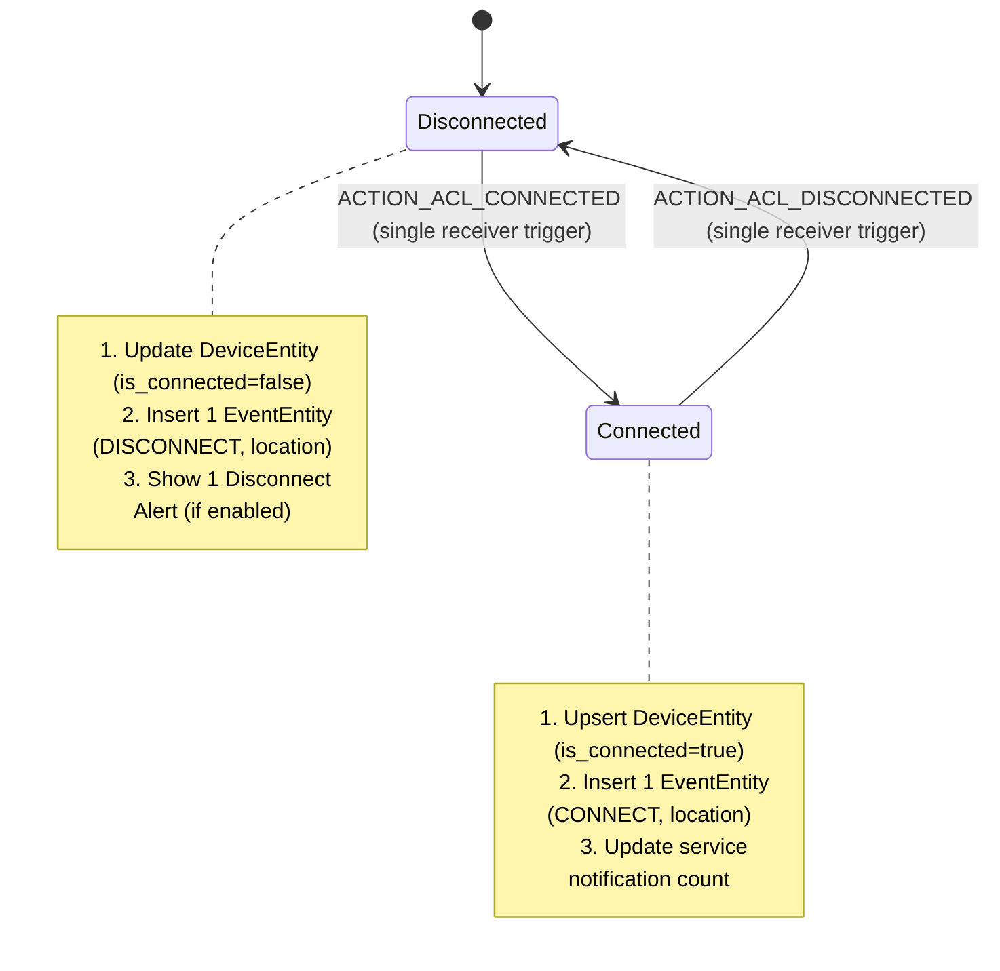

# Data Model: Deduplicate Bluetooth Receiver

**Feature**: Deduplicate Bluetooth Receiver (`001-deduplicate-bluetooth-receiver`)  
**Status**: Completed  
**Date**: 2026-09-02  

---

## 1. Entities & Schema

The data model utilizes SQLite via Android Jetpack Room. No schema migration is required for this feature, as the existing entities correctly model the domain. The goal of this feature is data integrity: ensuring that each physical Bluetooth event produces exactly 1 `EventEntity` record instead of 2.

### 1.1 `EventEntity` (`events` table)

Records a historical Bluetooth connection or disconnection event.

| Field | Type | Nullable | Constraints / Defaults | Description |
| :--- | :--- | :---: | :--- | :--- |
| `id` | `Long` | No | Primary Key, Auto-generate | Unique identifier of the event record |
| `device_id` | `Long` | No | Foreign Key (`devices.id`, CASCADE) | Associated device |
| `event_type` | `String` | No | "CONNECT" \| "DISCONNECT" | Type of Bluetooth transition |
| `timestamp` | `Long` | No | Default: current time in ms | Epoch timestamp of event |
| `latitude` | `Double` | Yes | - | GPS latitude at moment of event |
| `longitude` | `Double` | Yes | - | GPS longitude at moment of event |
| `accuracy` | `Float` | Yes | - | GPS horizontal accuracy (meters) |
| `location_address`| `String` | Yes | - | Reverse-geocoded human-readable address |
| `is_unexpected_disconnect` | `Boolean` | No | Default: `false` | Indicates sudden loss of connection |

**Indices**:
- Index on `device_id`
- Index on `timestamp`

### 1.2 `DeviceEntity` (`devices` table)

Represents tracked Bluetooth peripherals.

| Field | Type | Nullable | Constraints / Defaults | Description |
| :--- | :--- | :---: | :--- | :--- |
| `id` | `Long` | No | Primary Key, Auto-generate | Unique identifier of the device record |
| `name` | `String` | No | - | Bluetooth friendly name or fallback |
| `mac_address` | `String` | No | Unique Index | Hardware MAC address (`XX:XX:XX:XX:XX:XX`) |
| `device_type` | `String` | No | Default: "OTHER" | HEADSET, SPEAKER, WATCH, CAR, etc. |
| `is_connected` | `Boolean` | No | Default: `false` | Current connection state |
| `last_event_timestamp` | `Long` | No | Default: current time in ms | Timestamp of latest event |
| `last_event_type` | `String` | No | Default: "DISCONNECT" | Type of latest event |
| `last_latitude` | `Double` | Yes | - | Latest known latitude |
| `last_longitude` | `Double` | Yes | - | Latest known longitude |
| `last_location_address` | `String` | Yes | - | Latest known address |

---

## 2. Invariants & Data Integrity Rules

1. **Strict 1-to-1 Event Invariant**:
   - For every physical Bluetooth broadcast event (e.g. `BluetoothDevice.ACTION_ACL_CONNECTED`), exactly **1** record must be inserted into `events`.
   - Prior to this feature, dual registration inserted 2 rows for the same event with identical MAC addresses and timestamps within milliseconds of each other.
   - Post-implementation, duplicate insertion is eradicated at the broadcast reception level.

2. **Device Upsert Invariant**:
   - When an event occurs for an unrecorded device, a new `DeviceEntity` is created.
   - When an event occurs for an existing device, the existing `DeviceEntity` is updated with `isConnected = (eventType == "CONNECT")` and the latest location/timestamp.

---

## 3. State Transitions

