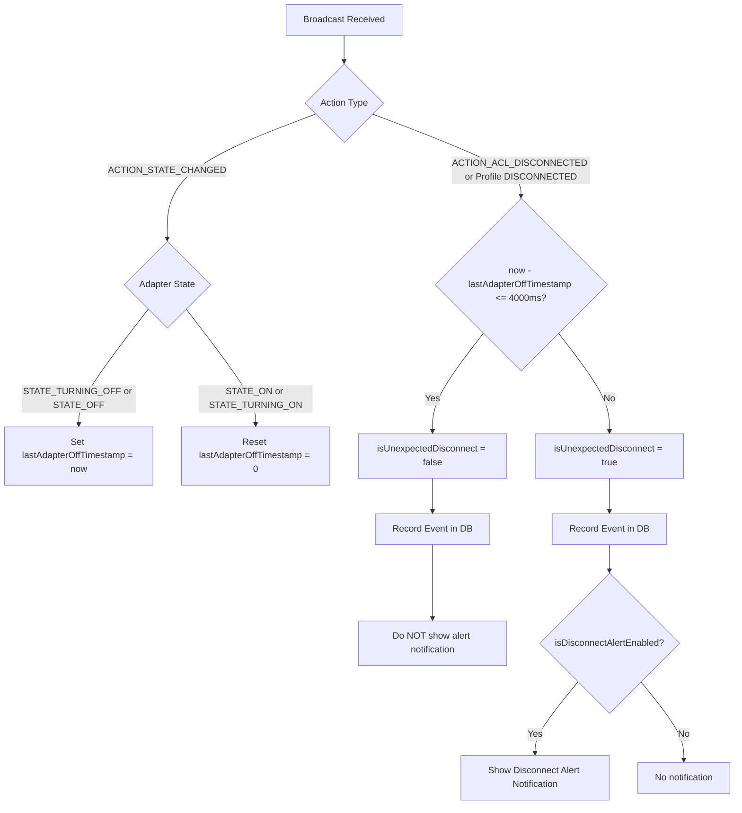

# Data Model: Classify Unexpected Disconnect

**Feature**: Classify Unexpected Disconnect (`002-classify-unexpected-disconnect`)  
**Status**: Completed  
**Date**: 2026-09-02  

---

## 1. Schema & Entities

This feature utilizes the existing Room schema without requiring database migrations. It refines the semantics and accuracy of the existing `is_unexpected_disconnect` column in the `events` table.

### 1.1 `EventEntity` (`events` table)

| Field | Type | Role | Updated Classification Behavior |
| :--- | :--- | :--- | :--- |
| `id` | `Long` | Primary Key | Auto-generated |
| `device_id` | `Long` | Foreign Key | Target device ID |
| `event_type` | `String` | Event discriminator | "CONNECT" or "DISCONNECT" |
| `timestamp` | `Long` | Event time | Milliseconds epoch timestamp |
| `latitude`, `longitude`, `accuracy`, `location_address` | `Double?`, `Float?`, `String?` | Location | Resolved GPS location at moment of disconnect |
| **`is_unexpected_disconnect`** | **`Boolean`** | **Intent Classifier** | **`false`** if preceded by adapter turn-off within 4000ms (intentional); **`true`** if disconnected spontaneously while adapter active (unexpected). |

---

## 2. Invariants & Heuristic Classification Matrix

| Trigger Action | Prior Adapter State within 4000ms | Classified Event Type | `is_unexpected_disconnect` | Disconnect Notification Triggered? |
| :--- | :--- | :---: | :---: | :---: |
| `ACTION_ACL_CONNECTED` | Any | `CONNECT` | `false` | No |
| `ACTION_ACL_DISCONNECTED` | `STATE_TURNING_OFF` or `STATE_OFF` | `DISCONNECT` | **`false`** | **No (Suppressed)** |
| `ACTION_ACL_DISCONNECTED` | None (`STATE_ON`) | `DISCONNECT` | **`true`** | **Yes (if enabled in settings)** |
| A2DP/Headset `STATE_DISCONNECTED` | `STATE_TURNING_OFF` or `STATE_OFF` | `DISCONNECT` | **`false`** | **No (Suppressed)** |
| A2DP/Headset `STATE_DISCONNECTED` | None (`STATE_ON`) | `DISCONNECT` | **`true`** | **Yes (if enabled in settings)** |

---

## 3. State Transition Diagram

