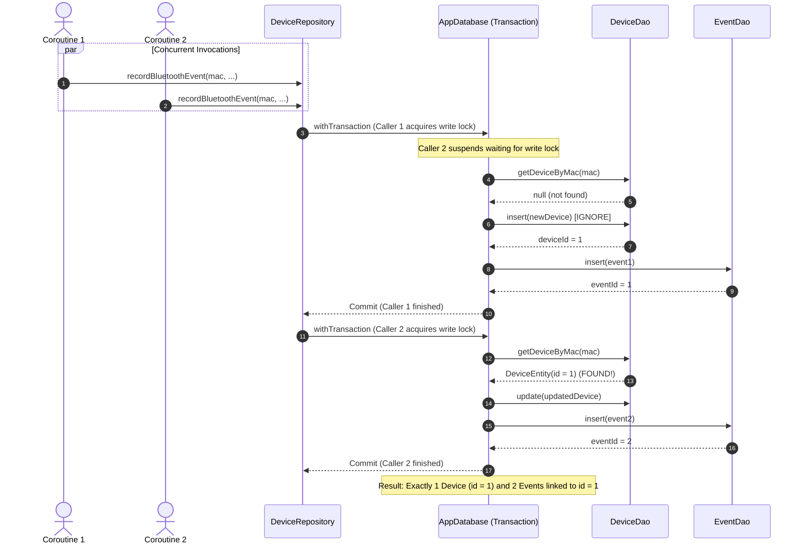

# Data Model: Transactional Device Event Upsert

**Feature**: Transactional Device Event Upsert (`003-transactional-device-upsert`)  
**Status**: Completed  
**Date**: 2026-09-02  

---

## 1. Relational Entities & Constraints

### 1.1 `DeviceEntity` (`devices` table)

```kotlin
@Entity(
    tableName = "devices",
    indices = [
        Index(value = ["mac_address"], unique = true),
        Index(value = ["is_connected"]),
        Index(value = ["last_event_timestamp"])
    ]
)
data class DeviceEntity(
    @PrimaryKey(autoGenerate = true)
    val id: Long = 0,
    val name: String,
    val macAddress: String,
    val deviceType: String = "OTHER",
    val isConnected: Boolean = false,
    val lastEventTimestamp: Long = 0,
    val lastEventType: String = "",
    val lastLatitude: Double? = null,
    val lastLongitude: Double? = null,
    val lastLocationAddress: String? = null
)
```

### 1.2 `EventEntity` (`events` table)

```kotlin
@Entity(
    tableName = "events",
    foreignKeys = [
        ForeignKey(
            entity = DeviceEntity::class,
            parentColumns = ["id"],
            childColumns = ["device_id"],
            onDelete = ForeignKey.CASCADE
        )
    ],
    indices = [
        Index(value = ["device_id"]),
        Index(value = ["timestamp"]),
        Index(value = ["event_type"])
    ]
)
data class EventEntity(
    @PrimaryKey(autoGenerate = true)
    val id: Long = 0,
    val deviceId: Long,
    val eventType: String,
    val timestamp: Long,
    val latitude: Double? = null,
    val longitude: Double? = null,
    val accuracy: Float? = null,
    val locationAddress: String? = null,
    val isUnexpectedDisconnect: Boolean = false
)
```

---

## 2. Concurrency Invariants & Guarantees

| Invariant | Description | Enforced By |
| :--- | :--- | :--- |
| **Uniqueness of MAC** | `COUNT(devices WHERE mac_address = :mac) <= 1` at all times | SQLite unique index + `withTransaction` + safe upsert |
| **Cascade Safety** | A device's `id` is NEVER changed or deleted during an update | Replaced `OnConflictStrategy.REPLACE` with `IGNORE` + update |
| **Atomic Association** | Every `EventEntity.device_id` refers to a valid committed `DeviceEntity.id` | Single atomic transaction enclosing device upsert and event insert |
| **Idempotent Parallel Writes** | $N$ simultaneous writes for the same MAC create 1 device and $N$ events | Serialized transaction boundary |

---

## 3. Transaction Sequence Diagram


