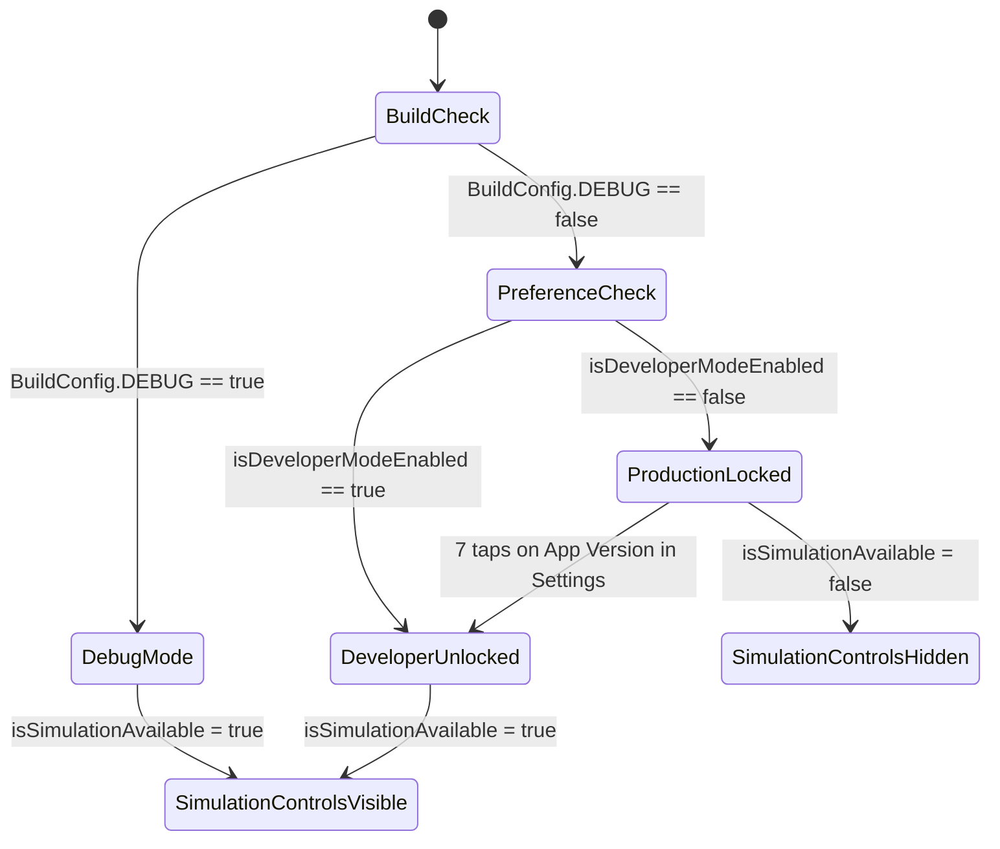
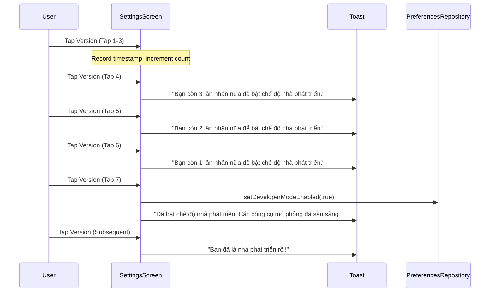

# Data Model & State Transitions: Simulation Gating & Developer Mode

**Feature**: `009-gate-simulate-feature`  
**Date**: 2026-09-02  

---

## 1. DataStore Preferences Schema

Stored via Android Jetpack DataStore Preferences in `settings_preferences.preferences_pb`:

| Key Name | Type | Default Value | Description |
|:---|:---:|:---:|:---|
| `KEY_SERVICE_ENABLED` | `Boolean` | `true` | Existing: Foreground service toggle |
| `KEY_DISCONNECT_ALERT_ENABLED` | `Boolean` | `true` | Existing: Disconnect alarm toggle |
| `KEY_ONBOARDING_COMPLETED` | `Boolean` | `false` | Existing: First-launch onboarding state |
| `KEY_DEVELOPER_MODE_ENABLED` | `Boolean` | `false` | **New**: Unlocks mock event generators in release builds |

---

## 2. State Machine: Simulation Availability

---

## 3. UI Component Gating Matrix

| UI Component | File | Test Tag / Identifier | Visibility when `isSimulationAvailable == false` | Visibility when `isSimulationAvailable == true` |
|:---|:---|:---|:---:|:---:|
| "Mô phỏng" FloatingActionButton | `DeviceListScreen.kt` | `"simulate_fab"` | **HIDDEN** | **VISIBLE** |
| Empty-state "Thêm dữ liệu mẫu" Button | `DeviceListScreen.kt` | `"btn_add_sample_data"` | **HIDDEN** | **VISIBLE** |
| "Mô phỏng Kết nối" Menu Item | `DeviceDetailScreen.kt` | `"menu_simulate_connect"` | **HIDDEN** | **VISIBLE** |
| "Mô phỏng Ngắt kết nối" Menu Item | `DeviceDetailScreen.kt` | `"menu_simulate_disconnect"` | **HIDDEN** | **VISIBLE** |
| App Version Row | `SettingsScreen.kt` | `"settings_app_version"` | **VISIBLE** | **VISIBLE** |
| `DeviceViewModel.simulateTestEvent()` | `DeviceViewModel.kt` | N/A (Code API) | **ACTIVE** (Direct calls only) | **ACTIVE** |

---

## 4. Developer Mode Tap State Machine

